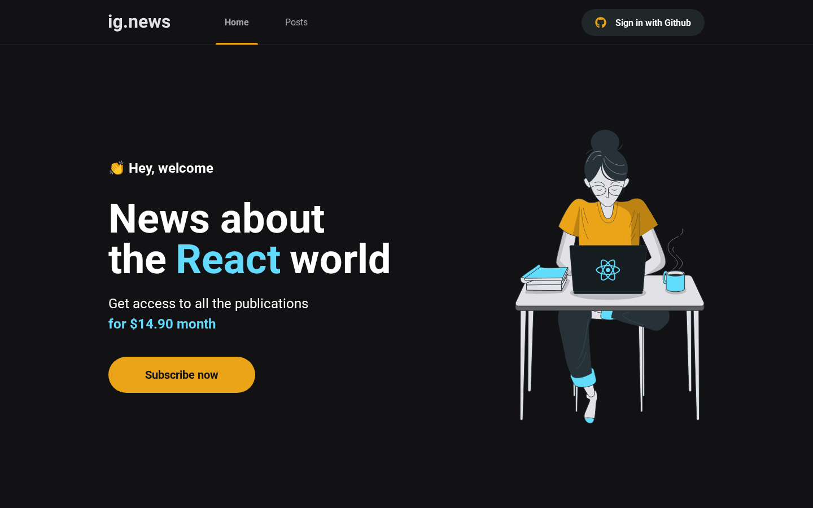
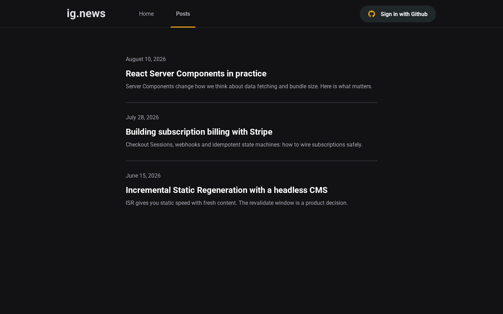
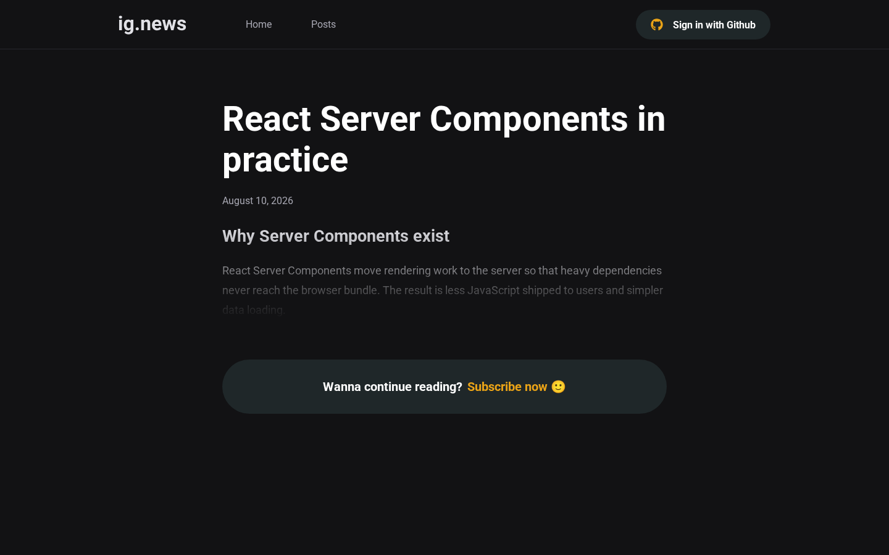
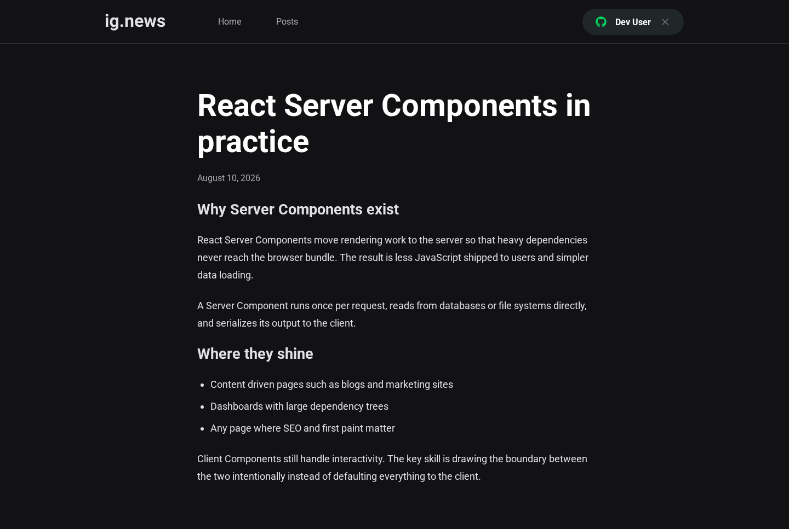

# ig.news


A subscription blog where readers sign in with GitHub, subscribe through
Stripe Checkout and unlock full posts served from a headless CMS. Originally
built during [Rocketseat Ignite](https://www.rocketseat.com.br) (2022),
fully modernized in 2026 for Node 22 LTS.



## What it demonstrates

- Stripe Checkout subscription flow with signed webhook handling and an
  idempotent subscription upsert
- GitHub OAuth via next-auth with a JWT session enriched by the active
  subscription state
- Paywall logic: anonymous visitors get a truncated preview, active
  subscribers read the full post
- ISR content from a headless CMS plus server rendered paywalled routes
- Pluggable integration providers: real Stripe and Prismic when credentials
  exist, sandbox implementations so the whole app runs offline out of the box
- Strict TypeScript end to end, zod validated API routes with a shared
  `{ data, error }` envelope, Playwright E2E suite

## Screenshots

| Posts | Paywall preview |
| --- | --- |
|  |  |

| Full post as subscriber | Mobile |
| --- | --- |
|  |  |

## Stack

| Layer | Tools |
| --- | --- |
| Framework | Next.js 16 (pages router), React 19 |
| Language | TypeScript 5 strict mode |
| Styling | Sass modules, react-icons |
| Payments | Stripe SDK 22 (checkout sessions + webhooks) |
| Auth | next-auth 4 (GitHub provider, optional dev login) |
| Database | Prisma 7 + SQLite (driver adapter) |
| Content | Prismic CMS v7 client |
| Validation | zod 4 |
| Testing | Playwright |

### The FaunaDB decision

The original project stored subscriptions in FaunaDB. Fauna discontinued its
service, so the data layer was rewritten to Prisma 7 with SQLite through an
official driver adapter. Local SQLite keeps the portfolio self contained:
clone, migrate, seed, run.

## Getting started

Requirements: Node.js 22+ and npm.

```bash
npm install
cp .env.example .env    # works empty: sandbox providers kick in
npx prisma migrate deploy
npm run db:seed         # three demo users, one with an active subscription
npm run dev             # http://localhost:3010
```

Without any credentials the app runs in sandbox mode: sample posts replace
Prismic, checkout redirects to the success page instead of Stripe, and an
email only development login (`AUTH_DEV_LOGIN=true`) lets you simulate both
a paying reader (`alice@example.com`) and a visitor without a plan
(`carol@example.com`).

### Going live with real providers

1. Stripe test account: create the `ig.news` product with a monthly recurring
   price, then fill `STRIPE_SECRET_API_KEY`, `NEXT_PUBLIC_STRIPE_PUBLIC_KEY`,
   `STRIPE_PRICE_ID`. Forward webhooks with `stripe listen --forward-to
   localhost:3010/api/webhooks` and copy the printed signing secret into
   `STRIPE_WEBHOOK_SECRET`.
2. GitHub OAuth app: callback URL
   `http://localhost:3000/api/auth/callback/github`, then set
   `GITHUB_CLIENT_ID` and `GITHUB_CLIENT_SECRET`.
3. Prismic: create a repository using the model in `customtypes/posts`,
   publish posts, then set `PRISMIC_ENDPOINT` and `PRISMIC_ACCESS_TOKEN`.

## Scripts

| Command | Description |
| --- | --- |
| `npm run dev` | Development server |
| `npm run build` / `npm run start` | Production build and serve |
| `npm run typecheck` | Strict TypeScript check |
| `npm run lint` | ESLint (flat config, next core-web-vitals) |
| `npm run test:e2e` | Playwright suite (desktop and mobile) |
| `npm run db:migrate` / `db:seed` / `db:studio` | Prisma workflows |
| `npm run stripeListen` | Forward Stripe webhooks locally |

## Project layout

```
src/
  components/     Header, ActiveLink, SignIn button, Subscribe button
  lib/            prisma client, auth options, api envelope helpers, formatting
  pages/          home, posts list, paywalled post, preview route
  pages/api/      auth/[...nextauth], subscribe, webhooks
  services/       cms provider (prismic/sandbox), payment gateway (stripe/sandbox)
prisma/           schema, init migration, realistic seed
tests/e2e/        Playwright specs
customtypes/      Prismic post content model
```

## Roadmap

- [ ] Unit tests alongside the E2E suite (registered debt)
- [ ] Customer billing portal session endpoint
- [ ] Swap SQLite for Postgres to mirror production databases
- [ ] Rate limiting on API routes

## License

[MIT](LICENSE)

## Author

Built by [Tiago Gonçalves de Castro](https://github.com/tiagogcastro)
· [LinkedIn](https://www.linkedin.com/in/tiagogcastro)
